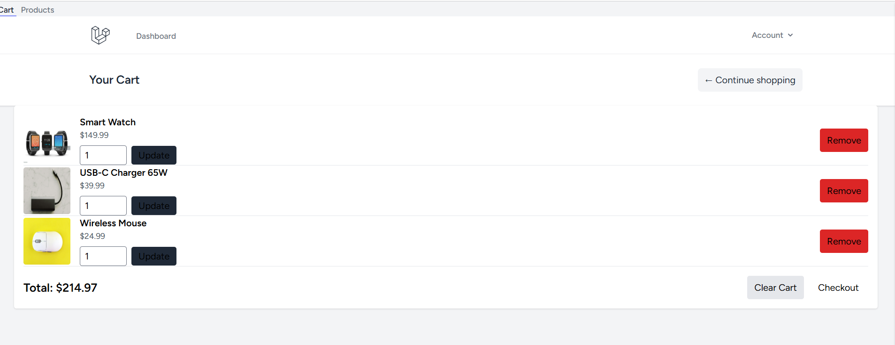
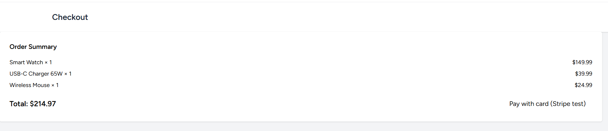
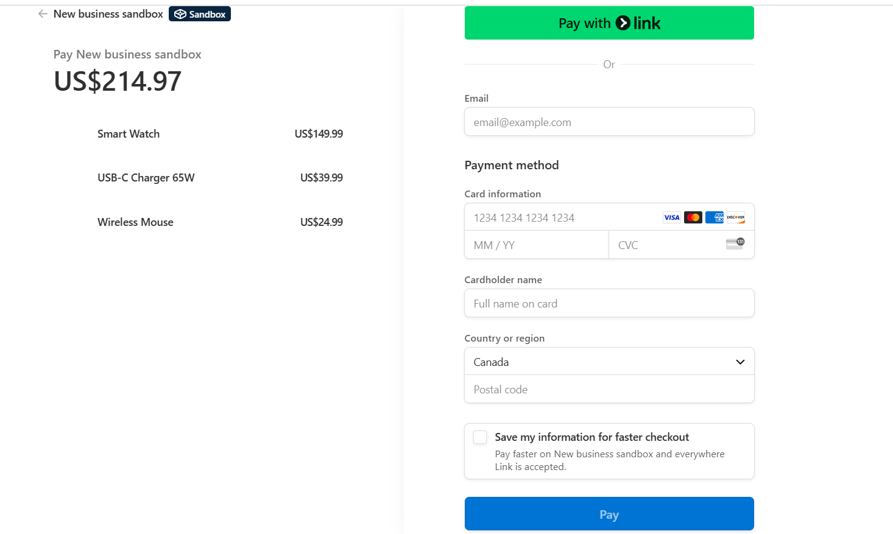

# 🛒 Laravel E-Commerce Store with Stripe Payment Gateway

## 📌 Overview
This project is a fully functional **E-Commerce web application** built using Laravel, featuring:
- User authentication
- Product browsing
- Shopping cart
- Stripe payment integration
- Order management

It is designed to showcase modern **full-stack development skills** with a focus on **secure online transactions**.

---

## 🚀 Features
- **Product Listing** – View all available products.
- **Product Details** – Dedicated page for each product.
- **Shopping Cart** – Add, remove, and update quantities.
- **Checkout with Stripe** – Secure payment processing.
- **User Authentication** – Register, login, and manage profiles.
- **Order Management** – Track and manage customer orders.

---

## 🛠️ Tech Stack
- **Backend:** Laravel 10, PHP 8+
- **Frontend:** Blade templates, Tailwind CSS
- **Database:** MySQL
- **Payment Gateway:** Stripe API
- **Version Control:** Git & GitHub

---
## 📸 Screenshots






## ⚙️ Installation
1. **Clone the repository**
   ```bash
   git clone https://github.com/DimaNaeem/laravel-ecommerce-stripe.git
   cd laravel-ecommerce-stripe
